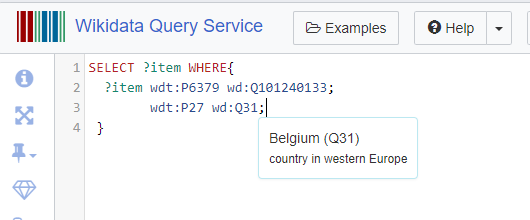
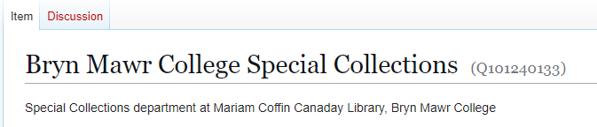
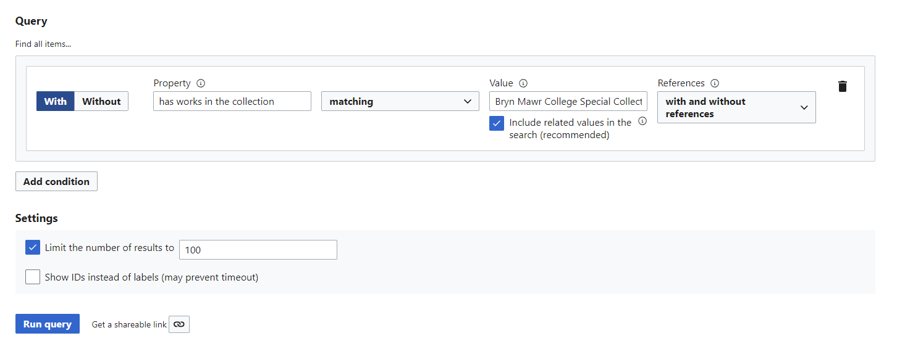

# SPARQL and SPARQL Queries!

### Table of Contents:
- [Intro](#what-is-sparql)
- [Basic Syntax of a Query](#basic-syntax-of-a-query)
- [Triples](#triples)
- [SELECT Clause](#select)
- [WHERE Clause](#where)
- [Prefixes](#so-what-is-a-prefix)
- [Wikidata Query Builder](#wikidata-query-builder)
- [Examples of Queries](#query-examples)
- [Glossary](#glossary) 


## What is SPARQL? 
SPARQL (pronounced 'sparkle' :sparkles:) is a query language for the Semantic Web, including Wikidata. SPARQL is a recursive acronym which stands for SPARQL Protocol and RDF Query Language. Using SPARQL, users can easily search and filter data within an RDF (Resource Description Framework) format to their specifications. It uses much of the same logic as SQL, and is composed using 'triple statements.' To learn more about SQL, [click here!](https://www.w3schools.com/whatis/whatis_sql.asp) Additionally, here is [Wikidata's SPARQL Tutorial!](https://www.wikidata.org/wiki/Wikidata:SPARQL_tutorial)
 

## Basic Syntax of a Query

```sql

#specify what you want to search for
SELECT ?item
WHERE {
#triple!
    subject_uri predicate_uri oject_uri.
}
```

### Triples
The key to SPARQL queries is understanding the semantic triple format, which will be familiar if you have prior knowledge of SQL. SPARQL views Wikidata (and all RDF databases) through being composed of statements in this triple structure. A triple is a sequence of three entities (things) that creates a statement about semantic data. More specifically, triples are formed by subject-predicate-object statements, where in SPARQL the URIs (Uniform Resource Identifiers) would be used, and a triple could also be described as entity identifier-attribute name-attribute value. Some examples of this triple structure would be:

**Joan Baez** (subject) *has works in the collection* (predicate) **Bryn Mawr College Special Collections** (object)

**Vincent Van Gogh** (subject) *painted* (predicate) **Sunflowers** (object)

**Bryn Mawr College Special Collections** (subject) *is an instance of* (predicate) **an archive** (object)


Notice here that even the verbs are part of the structure and have their own URI. These specific verbs and verb phrases (like **is an instance of** or **was born**) actually have their own URIs act as a link between the subject and the object. 

Before you create you SPARQL query, it can be helpful to first think of the phrase using this triple structure! 

### Select 
The ``` SELECT ``` clause defines the result set to be returned. Typically, you can select an ?item, but multiple things can be selected in one query, like an ?itemLabel or a picture (?pic). Additionally, you may see ``` SELECT DISTINCT ```, which will return only unique values in the table or ``` SELECT * ``` which selects everything from a given query. 

### Where
The ```sql WHERE``` clause is the place where you input the majority of the query. This specifies what you want the result to be, as SPARQL will filter what you wanted to SELECT using the criteria in the WHERE. 

In the ``` WHERE ``` clause, you can have multiple criteria within a query. To separate different triples, make sure to use ';' (a semicolon) in between each triple that has the same subject. For example, if you wanted to find artists in Bryn Mawr's Special Collections who were also citizens of Belgium this is what the query would look like:

```sql
SELECT ?item
WHERE{
#First part filtering people with works in BMC Spec Coll
?item wdt:P6379 wd:Q101240113;
#second part specifying country of origin as Belgium
        wdt:P27 wd:Q31.
}
```
Notice in this query the prefixes wdt and wd for object and entity, as well as only specifying the first part of the triple (?item) one time for both. However, if you were selecting multiple things (like for example a person and a place) in the select clause, you would need to write those full triples and separate them using a period. 

When you end a query, make sure to use a period and to close the curly braces. 


And remember, you don't have to memorize all of the reference IDs, just use control+space and type the word/phrase you're looking for! If you paste this into the Query Service, hovering over the entities and object IDs will also bring a pop-up which tells you what they reference. 




### So, what is a prefix? 
A prefix is a shortcut which references a URI. This prefix can then be referenced throughout the query and makes the code simpler, shorter, and more readable. Some prefixes are built into Wikidata, like property and entity. 

The property identifier prefix would be established like this:
```sql
PREFIX wdt: <http://wikidata.org/prop/direct/>
```
And the one for entity looks like this:
```sql
PREFIX wd: <http://www.wikidata.org/entity/
```
When you make more complicated queries or will use a particular URI, this will be especially helpful to create a shortcut to a particular part of the database you're querying. It is also good to know the built-in prefixes as they're used in most basic searches! Most commonly in simple queries, you will be using wdt: (for items) and wd: (for properties). Without using prefixes, the entire URI would have to be written out each time.

```sql
# Referencing Bryn Mawr College Special Collections without prefixes:
<http://wikidata.org/entity/Q101240133>

# With prefixes
wd:Q10124133
```
### SPARQL (in WikiData) Hack!
After typing the prefix you want, press control + space on your keyboard to type out your entity/property name. This way, you don't need to memorize the object ID or type long strings of numbers! However, if you did want to find the reference ID for a page on Wikidata, it would be in parenthesis after the title of the page (as seen below). 



[More information on prefixes and the list of built-in's can be found here. ]([url](https://en.wikibooks.org/wiki/SPARQL/Prefixes#:~:text=For%20simple%20WDQS%20triples%2C%20items%20should%20be%20prefixed,fixed%20values%20%E2%80%93%20variables%20don%E2%80%99t%20get%20a%20prefix.))

While SPARQL queries at first may look like a jumble of numbers and letters, it can actually be very user friendly!

## Wikidata Query Builder
Wikidata offers a service to build simple SPARQL queries without knowledge of SPARQL. For the Query Builder, you will be asked to put in a property and a value, and the service will return the item and the itemLabel, creating a simple query! You can add as many conditions (using the blue button) to filter your search further, using the same property and value structure. 



Additionally, if you wanted to edit the query further, you can show the query in the Query Service. Viewing and editing the query you designed in the query builder is also a great way to become familiar with the structure of SPARQL!

## Query Examples

#### Find all the women artists in Bryn Mawr's Special Collections:
```sql
#selecting only unique
SELECT DISTINCT * 
WHERE{
#triple one filtering for those with works in BMC Special Collections 
  ?item wdt:P6379 wd:Q101240133;
#triple two filtering for women (*is an instance of* woman)
        wdt:P21 wd:Q6581072.}
```

#### Return all the artists that have works in the collection at the Art Institute of Chicago:
```sql
SELECT ?item ?itemLabel   
WHERE {  
    ?item wdt:P106 wd:Q483501;  
          wdt:P6379 wd:Q239303  
SERVICE wikibase:label { bd:serviceParam wikibase:language "[AUTO_LANGUAGE],en". }  
}
```

#### Return the ceramicists in Bryn Mawr College's Special Collections as an Image Grid:
```sql
#defaultView:ImageGrid
#must select both the item and the picture, and within the query both must be defined
SELECT ?item ?pic WHERE{
  ?item
        wdt:P106 wd:Q7541856;
        wdt:P6379 wd:Q101240133;
        wdt:P18 ?pic.
}
```

#### Find all the visual artists who have works in Bryn Mawr's Special Collections and in the Stedelijk Museum in Amsterdam:
```sql
SELECT ?item ?itemLabel WHERE{
#triple one selecting visual artist (item-occupation-visual artist)
  ?item wdt:P106 wd:Q3391743;
#triple two filtering BMC Special Collections (item-has works in collection-BMC Spec Col)
        wdt:P6379 wd:Q101240133;
#triple three filtering Stedelijk (item-has works in collection-Stedelijk)
        wdt:P6379 wd:Q924335.
#connecting to the label service to also return names
SERVICE wikibase:label { bd:serviceParam wikibase:language "en". } 
}
```

# Glossary 
There are a lot of terms relating to SPARQL and Wikidata, many of which are related but not interchangeable. SPARQL and Wikidata are built under the world and concepts of the 'Semantic Web.' [If you're new to the Semantic Web, check out the article linked here for a brief overview and explanation.  ]([url](https://www.ontotext.com/knowledgehub/fundamentals/what-is-the-semantic-web/#:~:text=The%20Semantic%20Web%20is%20a%20vision%20about%20an,otherwise%20existing%20content%20and%20data%20on%20the%20Web.))

### Linked Data
Linked data is structured data, in the form of semantic triples: subject, predicate, object.  Ontotext defines it succinctly as, an overarching “set of design principles for sharing machine-readable interlinked data on the Web.” For this project, the information contained in the triple is: an artist (subject), has works in the collection of (predicate), Bryn Mawr College Special Collections (object). Learn more [here](https://programminghistorian.org/en/lessons/intro-to-linked-data).

### SQL 
SQL stands for Structured Query Language and is used to manage data in relational databases, including retrieving, creating, deleting, or updating records within a database. Click [here]([https://www.sqltutorial.org/what-is-sql/](https://www.w3schools.com/sql/sql_intro.asp)) to learn more and find explainations of SQL functions. 

### Semantic Web
The semantic web is an extension of the World Wide Web, but in an attempt to create a machine readable version of the web. Wikidata stemmed from the concept of the Semantic Web, attemping to create (in a nutshell) a machine readable and searchable version of Wikipedia. Read further [here](https://www.w3.org/RDF/Metalog/docs/sw-easy) or read [this article](https://link.springer.com/referenceworkentry/10.1007/978-1-4614-8265-9_1320) which explores the historical contex and foundation of the Semantic Web. 

### RDF (Resource Description Framework)
RDF is a way for representing interconnected (or linked) data on the web. It is essentially the data modeling language for the Semantic web as all the information stored on the Semantic web is represented in this framework. A semantic triple or an RDF triple is the data entity in an RDF data model. Wikidata is modeled on the use of the RDF framework. 
Click [here](https://www.techtarget.com/searchapparchitecture/definition/Resource-Description-Framework-RDF) to learn more or [here](https://www.w3.org/TR/rdf-sparql-query/
) for a detailed description of RDF within the SPARQL query language. 

### URI (Uniform Resource Identifier)
Provides a means of locating and retrieving information resources on a network (in this case, Wikidata). A URL (Uniform Resource Locator, which we use on the web everyday) is a specific type of URI that provides the specific location or address of a resource on the Internet (web page). However, a URI is used to define an item's identity, rather then just locate it. 
